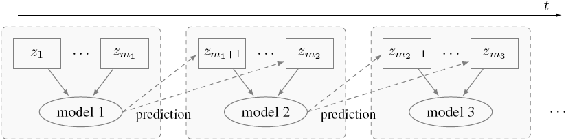
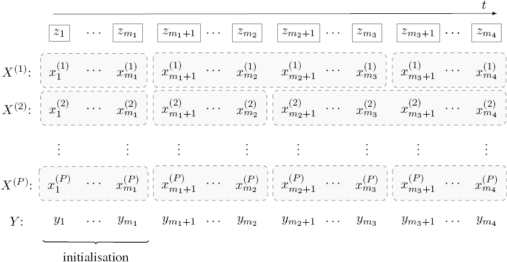

## Introduction

When analyzing chronological data with machine learning methods, the underlying distributions of the feature variables aren't usually constant but change over time *(concept drift)* to which the modelling and predictions have to be adapted.
In my master's thesis, it is investigated how the Naive Bayes classification method is able to do online learning, and with regard to *concept drift*, definitions from a recent article by Webb et al. (2016) as well as further explanations and examples are presented.
Then---based on the online Naive Bayes algorithm---the new NBCD method is developed and described, that tries to adjust to changing distributions when predicting the observations' label.  
That's what this R package is about.

You can directly install it via GitHub:
```{r install, eval = FALSE}
devtools::install_github("aschersleben/NBCD")
library(NBCD)
```
```{r setup, echo = FALSE, warning = FALSE}
library("ggplot2")
library("gridExtra")
library("gtable")
library("grid")
library("NBCD")
figgridsize <- 11
psize.mot <- 1.5
```

### Motivation

Let's first of all have a look at an introductory example. Imagine a data stream (i.e. data in a chronological order), like in the following figure: 

```{r fig-motivation0, echo = FALSE, fig.width = 6, fig.height = 5}
set.seed(1909)
data <- NULL
for (i in seq(0, 360, 30)) {
  tmp <- getDataRotNorm2(i, 15, sd = sqrt(0.2), both = TRUE)
  tmp2 <- do.call(rbind, replicate(13 - i / 30, cbind(tmp$x, class = tmp$class), simplify = FALSE))
  tmp2 <- cbind(tmp2, time = rep(seq(i, 360, 30) / 2, each = 15))
  data <- rbind(data, tmp2)
}
ttime <- c(0, 30, 60, 90, 135, 180)
ggplot(data[data$time %in% ttime, ], aes(x = x1, y = x2)) +
  geom_point(aes(colour = class, shape = class), size = psize.mot) +
  coord_fixed(xlim = c(-3, 3), ylim = c(-3, 3)) +
  xlab(expression(x[1])) + ylab(expression(x[2])) +
  scale_color_discrete(guide = guide_legend(title = "class"), labels = c("a", "b")) +
  scale_shape_discrete(guide = guide_legend(title = "class"), labels = c("a", "b")) + 
  facet_wrap(~ time, labeller = "label_both")
```

At the beginning, the data can be easily separated into the two classes *a* and *b*.
But adding more and more new data points, it leads to a big mess where no ordinary classification method would be able to separate the two classes.
We can see this by looking at the following two example approaches:

  1. Use the model, that was fitted at the beginning.  
     Clearly, this won't be very helpful...

```{r fig-motivation1, echo = FALSE, fig.width = 6, fig.height = 5, message = FALSE}
set.seed(1909)
data <- getDataRotNorm2(0, 15, sd = sqrt(0.2), both = TRUE)
mod <- nb2(data$x, data$class)
datab <- data.frame(x1 = data$x$x1, x2 = data$x$x2, class = factor(data$class))
p1 <- plot(mod, xlim = c(-3, 3), ylim = c(-3, 3), data = data, gridsize = figgridsize, psize = psize.mot) +
  xlab(expression(x[1])) + ylab(expression(x[2])) +
  scale_fill_discrete(guide = guide_legend(title = "class"),  labels = c("$a$", "$b$")) +
  scale_shape_discrete(guide = guide_legend(title = "class"), labels = c("$a$", "$b$")) +
  coord_fixed() +
  ggtitle("Initialisierung")
pl <- list()
i <- seq(30, 360, 30)
for (k in seq_along(i)) {
  data2 <- getDataRotNorm2(i[k], 15, sd = sqrt(0.2), both = TRUE)
  data <- list(x = rbind(data$x, data2$x), class = factor(c(data$class, data2$class)))
  pl[[k]] <- plot(mod, xlim = c(-3, 3), ylim = c(-3, 3), data = data, gridsize = figgridsize, psize = psize.mot) +
    xlab(expression(x[1])) + ylab(expression(x[2])) +
    # xlab("$x_1$") + ylab("$x_2$") +
    coord_fixed() +
    scale_fill_discrete(guide = guide_legend(title = "class"),  labels = c("$a$", "$b$")) +
    scale_shape_discrete(guide = guide_legend(title = "class"), labels = c("$a$", "$b$")) +
    ggtitle(paste("time", i[[k]] / 2))
}

data <- data2 <- NULL
for (i in seq(0L, 360L, 30L)) {
  tmp <- get("data", envir = if(i > 0) pl[[(i / 30L)]]$plot_env else p1$plot_env)
  tmp2 <- cbind(tmp, time = i / 2)
  data <- rbind(data, tmp2)
  tmp3 <- p1$data
  tmp3$time <- i / 2
  data2 <- rbind(data2, tmp3)
}

data <- data[data$time %in% ttime, ]
data2 <- data2[data2$time %in% ttime, ]
data3 <- subset(data, data$err)

ggplot() +
  geom_tile(data = data2, aes(x = x1, y = x2, fill = class, alpha = .prob.pred.class)) +
  geom_point(data = data, aes(x = x1, y = x2, shape = class), size = psize.mot) +
  geom_point(data = data3, aes(x = x1, y = x2, shape = class),
             size = psize.mot + 1.5, col = "white", show.legend = FALSE) +
  geom_point(data = data3, aes(x = x1, y = x2, shape = class),
             size = psize.mot, col = "black", show.legend = FALSE) +
  scale_alpha(limits = c(1 / 2, 1)) +
  coord_fixed(xlim = c(-3, 3), ylim = c(-3, 3)) +
  guides(alpha = FALSE) +
  xlab(expression(x[1])) + ylab(expression(x[2])) +
  scale_fill_discrete(guide = guide_legend(title = "class"),  labels = c("a", "b")) +
  scale_shape_discrete(guide = guide_legend(title = "class"), labels = c("a", "b")) +
  facet_wrap(~ time, labeller = "label_both")
```

  2. Fit a new model with all available observations:
  
```{r fig-motivation2, echo = FALSE, fig.width = 6, fig.height = 5, message = FALSE}
set.seed(1909)
data <- getDataRotNorm2(0, 15, sd = sqrt(0.2), both = TRUE)
mod <- nb2(data$x, data$class)
datab <- data.frame(x1 = data$x$x1, x2 = data$x$x2, class = factor(data$class))
p1 <- plot(mod, xlim = c(-3, 3), ylim = c(-3, 3), data = data, gridsize = figgridsize, psize = psize.mot) +
  xlab(expression(x[1])) + ylab(expression(x[2])) +
  scale_fill_discrete(guide = guide_legend(title = "class"),  labels = c("$a$", "$b$")) +
  scale_shape_discrete(guide = guide_legend(title = "class"), labels = c("$a$", "$b$")) +
  coord_fixed() +
  ggtitle("Initialisierung")
pl <- list()
i <- seq(30, 360, 30)
for (k in seq_along(i)) {
  data2 <- getDataRotNorm2(i[k], 15, sd = sqrt(0.2), both = TRUE)
  data <- list(x = rbind(data$x, data2$x), class = factor(c(data$class, data2$class)))
  pl[[k]] <- plot(mod, xlim = c(-3, 3), ylim = c(-3, 3), data = data, gridsize = figgridsize, psize = psize.mot) +
    xlab(expression(x[1])) + ylab(expression(x[2])) +
    coord_fixed() +
    scale_fill_discrete(guide = guide_legend(title = "class"),  labels = c("$a$", "$b$")) +
    scale_shape_discrete(guide = guide_legend(title = "class"), labels = c("$a$", "$b$")) +
    ggtitle(paste("time", i[[k]] / 2))
  mod <- update(mod, newdata = data2$x, y = data2$class)
}
data <- data2 <- dat <- NULL
for (i in seq(0L, 360L, 30L)) {
  tmp <- get("data", envir = if(i > 0) pl[[(i / 30L)]]$plot_env else p1$plot_env)
  tmp2 <- cbind(tmp, time = i / 2)
  tmp2b <- cbind(tail(tmp, 15), time = i / 2)
  if (i > 0) dat <- rbind(dat, tail(replace(dat, "time", i / 2), (i / 2)), tmp2b) else dat <- tmp2b
  data <- rbind(data, tmp2)
  
  tmp3 <- if (i > 0) pl[[(i / 30)]]$data else p1$data
  tmp3$time <- i / 2
  data2 <- rbind(data2, tmp3)
}

dat <- dat[dat$time %in% ttime, ]
data <- data[data$time %in% ttime, ]
data2 <- data2[data2$time %in% ttime, ]
data3 <- subset(dat, dat$err)

ggplot() +
  geom_tile(data = data2, aes(x = x1, y = x2, fill = class, alpha = .prob.pred.class)) +
  geom_point(data = dat, aes(x = x1, y = x2, shape = class), size = psize.mot) +
  geom_point(data = data3, aes(x = x1, y = x2, shape = class),
             size = psize.mot + 1.5, col = "white", show.legend = FALSE) +
  geom_point(data = data3, aes(x = x1, y = x2, shape = class),
             size = psize.mot, col = "black", show.legend = FALSE) +
  scale_alpha(limits = c(1 / 2, 1)) +
  coord_fixed(xlim = c(-3, 3), ylim = c(-3, 3)) +
  guides(alpha = FALSE) +
  xlab(expression(x[1])) + ylab(expression(x[2])) +
  scale_fill_discrete(guide = guide_legend(title = "class"),  labels = c("a", "b")) +
  scale_shape_discrete(guide = guide_legend(title = "class"), labels = c("a", "b")) +
  facet_wrap(~ time, labeller = "label_both")
```

In both cases, we can see that many misclassfication errors occur (white surrounded data points) and that at the end none of these solutions is useful. 


### Online Classification

When using classification methods, one uses *batch learning* in most cases, i.e. building a model on a complete data set and then doing some verifications like cross validation etc.
But it can be useful---not only, but of course also when analyzing a data stream---to add new observations to the model without building it completely again:

> *update* vs. *rebuild*

If an update is possible, you can delete old observations after including them to the model and therefore save storage and computing time [@GamaKD].

For many classification methods, it's a challenge to make them ready for this so called *online learning*, but this research area is increasing recently and becomes more and more interesting.

In the next subsection, I'd like to show you how to make the well-known and often-used **Naive Bayes** able to do online learning.


### Online Classification with Naive Bayes

We have already seen some Naive Bayes models in the figures above.
If you didn't know anything about Naive Bayes, you should first of all read about it at @ESL [pp. 106ff and 210ff] or another source.

In a nutshell: Given the observation values $X = x$, a *posterior* probability $\mathbb{P}(k\,|\,x)$ for every class $Y = k$ (i.e. possible output) can be calculated via Bayes' theorem:
$$\mathbb{P}_{Y\,|\,X}(k\,|\,x) = \frac{\pi_k \cdot \mathbb{P}_{X\,|\,Y}(x\,|\,k)}{\sum\limits_{\ell = 1}^K \Big(\pi_\ell \cdot \mathbb{P}_{X\,|\,Y}(x\,|\,\ell)\Big)}$$
$\pi_\ell$ is the *prior* probability of class $\ell$.

Naive Bayes works for both discrete and continuous features.
Discrete features are included in the Naive Bayes model via contingency tables, and the marginal distributions are just the relative probabilities taken from these tables.
So, including a new observation is quite easy, because you just have to increase the corresponding table cells by 1.
The same holds for the prior probabilities.

Here, for continuous features, we assume that the marginal distributions $f_{\ell j}$ (feature $X_j$, class $\ell$) are *normal* with parameters $\mu_{\ell j}$ and $\sigma^2_{\ell j}$.
They are estimated as usual, via $\bar x_{\ell j}$ and $s^2_{\ell j}$.
So, how to update them? For the mean, this is straightforward:
$$\bar{x}_{\ell j} = \frac{n - 1}{n}\ \bar{x}_{j,\text{old}} + \frac{1}{n}\ x_{j,\text{new}}$$
And, with the algorithm no. $S_7$ of @YoungsCramer, we just have to use two helper variables ($v_j$ and $t_j$), that have to be calculated, saved and updated in each update step.
The square sum $S$ of all observations is given by
$$\begin{aligned}
S & = v_n \quad \text{mit } v_j = v_{j - 1} + \frac{(j \cdot x_j - t_j)^2}{j \cdot (j - 1)}, \\
      & \hphantom{\ = v_n \quad \text{mit }} t_j = t_{j - 1} + x_j, \\
      & \hphantom{\ = v_n \quad \text{mit }} t_0, v_1 = 0. \\
      \Rightarrow s^2 & = \frac{1}{n - 1} \cdot S,
\end{aligned}$$
where $s^2$ is new the variance including the new observation $x_j$.
For other variance update algorithms see @Welford, @Hanson, @Cotton and @West.


### Concept Drift

In the field of data streams the question, that is more and more investigated, is, if resp. how good can (classification) models adapt to changing distributions.
This is called *concept drift*, and while there are already many articles about this subject, @Webb are the first ones who try to standardize/harmonize the terminology in this field.
I can highly recommend to read the article for a first look at and overview of this research area.

At this point, we will just have a look at two basic definitions and leave the rest for self-study...

* Definition: **Concept**  
  The joint probability distribution of $\mathcal{X}$ resp. of $X$ and $Y$ is called *concept*:
  $$\mathbb{P}(\mathcal{X}) \text{ resp. } \mathbb{P}(X, Y).$$

* Definition: **Concept Drift**  
    A *concept drift* between the two points in time $t$ and $u$ is existent, when the distribution (i.e. the concept) of $\mathcal{X}$ changes:
  $$\mathbb{P}_t (\mathcal{X}) \neq \mathbb{P}_u (\mathcal{X}).$$

After giving these definitions, @Webb provide some quantitative and qualitative measures to describe several types of concept drift, like the two following:

* Definition: **(Pure) Class Drift**  
  When the posterior distribution (i.e. the distribution of the class label $Y$ given the feature values $X$) changes over time, like:
  $$\mathbb{P}_t(Y | X) \neq \mathbb{P}_u(Y | X),$$
  it is called *class drift*.  
  If it holds simultaneously, that $\mathbb{P}_t(X) = \mathbb{P}_u(X)$, i.e. the unconditional distribution of the features doesn't change, it will be called *pure class drift*.
  An example can be seen in the following figure:  
```{r fig-example-pure-class-drift-unif, echo = FALSE, fig.width = 6, fig.height = 3, message = FALSE}
dat <- data.frame(id = c(rep("a", 5), rep("b", 5)),
                  x = c(-1, -1, 0, 0, -1, 0, 0, 1, 1, 0),
                  y = c(1, -1, -1, 1, 1, 1, -1, -1, 1, 1))
p1 <- ggplot(data = dat, aes(x, y))
p1 <- p1 + geom_polygon(aes(fill = id, group = id))
p1 <- p1 + coord_fixed()
p1 <- p1 +
  # lims(x = c(-1, 1), y = c(-1, 1)) +
  xlab(expression(x[1])) + ylab(expression(x[2])) +
  # xlab("$X_1$") + ylab("$X_2$") + 
  scale_fill_discrete(guide = guide_legend(title = "class"), labels = c("a", "b")) +
  # scale_shape_discrete(guide = guide_legend(title = "Klasse"), labels = c("a", "b")) + 
  ggtitle(paste0("Distribution of ", bquote(X), " at time ", bquote(t)))
  # ggtitle("Verteilung von $X$ zur Zeit $t$")

dat <- data.frame(id = c(rep("a", 7), rep("b", 5)),
                  x = c(-1, -1, 1, 1, 0, 0, -1, 0, 0, 1, 1, 0),
                  y = c(1, -1, -1, 0, 0, 1, 1, 1, 0, 0, 1, 1))
p2 <- ggplot(data = dat, aes(x, y))
p2 <- p2 + geom_polygon(aes(fill = id, group = id))
p2 <- p2 + coord_fixed()
p2 <- p2 +
  # lims(x = c(-1, 1), y = c(-1, )) +
  xlab(expression(x[1])) + ylab(expression(x[2])) +
  # xlab("$X_1$") + ylab("$X_2$") + 
  scale_fill_discrete(guide = guide_legend(title = "class"), labels = c("a", "b")) +
  # scale_shape_discrete(guide = guide_legend(title = "Klasse"), labels = c("a", "b")) + 
  ggtitle(paste0("Distribution of ", bquote(X), " at time ", bquote(u)))
  # ggtitle("Verteilung von $X$ zur Zeit $u$") 

# grid.arrange(p1, p2, ncol = 2)
p1b <- p1 + guides(fill = FALSE)
g1 <- ggplotGrob(p1b)
g1 <- gtable_add_cols(g1, unit(0,"mm")) # add a column for missing legend
g2 <- ggplotGrob(p2)
g <- cbind(g1, g2, size="first")
g$heights <- unit.pmax(g1$heights, g2$heights) 
g$layout[grepl("guide", g$layout$name),c("t","b")] <- c(1,nrow(g))
grid.newpage()
grid.draw(g)
```
  
* Definition: **(Pure) Covariate Drift**
  When the unconditional distribution changes over time, like
  $$\mathbb{P}_t(X) \neq \mathbb{P}_u(X)$$
  it is called *covariate drift* and equivalently to the previous definition, it will be called a *pure covariate drift*, if it holds simultaneously, that the posterior distribution $\mathbb{P}(Y\,|\,X)$ doesn't change. Example:  
```{r fig-example-pure-covariate-drift, echo = FALSE, fig.width = 6, fig.height = 3, message = FALSE}
dat1 <- expand.grid(x1 = seq(-2, 2, len = figgridsize), x2 = seq(-1, 2, len = figgridsize))
dat1b <- expand.grid(x1 = seq(-2, 2, len = 100), x2 = seq(-1, 2, len = 100))
dens1 <- function(x) {
  stopifnot(require(mvtnorm))
  (dmvnorm(x, c(-1, 1), diag(c(0.2, 0.2))) +
    dmvnorm(x, c(1, 1), diag(c(0.2, 0.2))))
}
dat1$Dichte <- dens1(dat1)
dat1$Klasse <- factor(ifelse(dat1$x1 < 0, "a", "b"))
dat1b$Dichte2 <- dens1(dat1b)

p1 <- ggplot(dat1, aes(x1, x2))
p1 <- p1 + geom_tile(aes(fill = Klasse, alpha = Dichte), show.legend = TRUE)
# p1 <- p1 + geom_contour(aes(z = Dichte, colour = ..level..), binwidth = 0.25, size = 0.25)
# p1 <- p1 + scale_colour_gradient(low = "grey30", high = "white")
p1 <- p1 + geom_contour(data = dat1b, aes(z = Dichte2), colour = "white", binwidth = 0.25, size = 0.25)
p1 <- p1 + scale_fill_discrete(guide = guide_legend(title = "class"), labels = c("a", "b"))
p1 <- p1 + scale_alpha(range = c(0, 1))
p1 <- p1 + guides(alpha = FALSE, colour = FALSE)
p1 <- p1 + coord_fixed()
p1 <- p1 +
  lims(x = c(-2, 2), y = c(-2, 2)) +
  xlab(expression(x[1])) + ylab(expression(x[2])) +
  # xlab("$X_1$") + ylab("$X_2$") + 
  ggtitle(paste0("Distribution of ", bquote(X), " at time ", bquote(t)))
  # ggtitle("Verteilung von $X$ zur Zeit $t$")

arr1 <- data.frame(x = -1, y = c(1, -1))
arr2 <- data.frame(x = 1, y = c(1, -1))

dat2 <- expand.grid(x1 = seq(-2, 2, len = figgridsize), x2 = seq(-2, 1, len = figgridsize))
dat2b <- expand.grid(x1 = seq(-2, 2, len = 100), x2 = seq(-2, 1, len = 100))
dens2 <- function(x) {
  stopifnot(require(mvtnorm))
  (dmvnorm(x, c(-1, -1), diag(c(0.2, 0.2))) +
    dmvnorm(x, c(1, -1), diag(c(0.2, 0.2))))
}
dat2$Dichte <- dens2(dat2[, 1:2])
dat2$Klasse <- factor(ifelse(dat2$x1 < 0, "a", "b"))
# dat2$Klasse <- factor(ifelse(dat2$x > 0 & dat2$y > 0, 1, 2))
dat2b$Dichte2 <- dens2(dat2b)

p2 <- ggplot(dat2, aes(x1, x2))
p2 <- p2 + geom_tile(aes(fill = Klasse, alpha = Dichte), show.legend = TRUE)
# p2 <- p2 + geom_contour(aes(z = Dichte, colour = ..level..), binwidth = 0.25, size = 0.25)
# p2 <- p2 + scale_colour_gradient(low = "grey30", high = "white")
p2 <- p2 + geom_contour(data = dat2b, aes(z = Dichte2), colour = "white", binwidth = 0.25, size = 0.25)
p2 <- p2 + geom_line(aes(x, y), data = arr1, arrow = arrow(angle = 15, length = unit(0.125, "inch"), ends = "last", type = "closed"), colour = "grey30", lineend = "round") +
  geom_line(aes(x, y), data = arr2, arrow = arrow(angle = 15, length = unit(0.125, "inch"), ends = "last", type = "closed"), colour = "grey30", lineend = "round")
p2 <- p2 + scale_fill_discrete(guide = guide_legend(title = "class"), labels = c("a", "b"))
p2 <- p2 + scale_alpha(range = c(0, 1))
p2 <- p2 + guides(alpha = FALSE, colour = FALSE)
p2 <- p2 + coord_fixed()
p2 <- p2 +
  lims(x = c(-2, 2), y = c(-2, 2)) +
  xlab(expression(x[1])) + ylab(expression(x[2])) +
  # xlab("$X_1$") + ylab("$X_2$") + 
  ggtitle(paste0("Distribution of ", bquote(X), " at time ", bquote(u)))
  # ggtitle("Verteilung von $X$ zur Zeit $u$")

# grid.arrange(p1, p2, ncol = 2)
p1b <- p1 + guides(fill = FALSE)
g1 <- ggplotGrob(p1b)
g1 <- gtable_add_cols(g1, unit(0,"mm")) # add a column for missing legend
g2 <- ggplotGrob(p2)
g <- cbind(g1, g2, size="first")
g$heights <- unit.pmax(g1$heights, g2$heights) 
g$layout[grepl("guide", g$layout$name),c("t","b")] <- c(1,nrow(g))
grid.newpage()
grid.draw(g)
```

Now that we know some basic things about *concept drift*: What can we do to handle it?
A good overview about some possible ways can be found in @Ditzler and in @Hoens.
In the former article, the authors differ between active and passive approaches:
Active ones try to detect the concept drift *actively* and may just fit new models, when the used mechanisms identify it, while passive ones fit new models with incoming data, independently of the existence of a concept drift.

@Hoens have a deeper look at these passive methods and they also mention the so-called *windowing* technique.
This approach belongs to the category *selection and/or weighting of data* and doesn't depend on any classification or learning method.
It just as easy as you can see it in the following figure:

```{r, echo = FALSE, out.width = "576px"}

```

The first $m_1$ observations are combined to the first, initial model.
Then, all new observations ($z_{m_{i-1}+1}, \ldots, z_{m_{i}}$, with $i = 1, 2, \ldots$ and $m_0 = 1$) are used to generate model $(i)$.
Their target value is predicted by the previous model $(i - 1)$.

We can use this windowing technique to improve the results of the examples shown above.
We choose the *window size* as 15 observations.

```{r fig-motivation3, echo = FALSE, fig.width = 6, fig.height = 8, message = FALSE}
set.seed(1909)
data <- getDataRotNorm2(0, 15, sd = sqrt(0.2), both = TRUE)
mod <- nb2(data$x, data$class)
datab <- data.frame(x1 = data$x$x1, x2 = data$x$x2, class = factor(data$class))
p1 <- plot(mod, xlim = c(-3, 3), ylim = c(-3, 3), data = data, gridsize = figgridsize, psize = psize.mot) +
  xlab(expression(x[1])) + ylab(expression(x[2])) +
  # xlab("$x_1$") + ylab("$x_2$") +
  scale_fill_discrete(guide = guide_legend(title = "class"),  labels = c("a", "b")) +
  scale_shape_discrete(guide = guide_legend(title = "class"), labels = c("a", "b")) +
  coord_fixed() +
  ggtitle("Initialisierung") #+
  # theme(legend.position = "left")

pl <- list()
i <- seq(30, 360, 30)
for (k in seq_along(i)) {
  data2 <- getDataRotNorm2(i[[k]], 15, sd = sqrt(0.2), both = TRUE)
  data <- list(x = rbind(data$x, data2$x), class = factor(c(data$class, data2$class)))
  pl[[k]] <- plot(mod, xlim = c(-3, 3), ylim = c(-3, 3), data = data2, gridsize = figgridsize, psize = psize.mot) +
    xlab(expression(x[1])) + ylab(expression(x[2])) +
    # xlab("$x_1$") + ylab("$x_2$") +
    scale_fill_discrete(guide = guide_legend(title = "class"),  labels = c("a", "b")) +
    scale_shape_discrete(guide = guide_legend(title = "class"), labels = c("a", "b")) +
    coord_fixed() +
    ggtitle(paste("time", i[[k]] / 2)) +
    theme(legend.position = "none")
  mod <- nb2(x = data2$x, y = data2$class)
}

data <- data2 <- NULL
for (i in seq(0L, 360L, 30L)) {
  tmp <- get("data", envir = if(i > 0) pl[[(i / 30L)]]$plot_env else p1$plot_env)
  tmp2 <- cbind(tmp, time = i / 2)
  data <- rbind(data, tmp2)
  
  tmp3 <- if (i > 0) pl[[(i / 30)]]$data else p1$data
  tmp3$time <- i / 2
  data2 <- rbind(data2, tmp3)
}

ttime2 <- seq(15, 180, 15)
data <- data[data$time %in% ttime2, ]
data2 <- data2[data2$time %in% ttime2, ]
data3 <- subset(data, data$err)

pp <- ggplot() +
  geom_tile(data = data2, aes(x = x1, y = x2, fill = class, alpha = .prob.pred.class)) +
  geom_point(data = data, aes(x = x1, y = x2, shape = class), size = psize.mot) +
  geom_point(data = data3, aes(x = x1, y = x2, shape = class),
             size = psize.mot + 1.5, col = "white", show.legend = FALSE) +
  geom_point(data = data3, aes(x = x1, y = x2, shape = class),
             size = psize.mot, col = "black", show.legend = FALSE) +
  scale_alpha(limits = c(1 / 2, 1)) +
  coord_fixed(xlim = c(-3, 3), ylim = c(-3, 3)) +
  guides(alpha = FALSE) +
  xlab(expression(x[1])) + ylab(expression(x[2])) +
  scale_fill_discrete(guide = guide_legend(title = "class"),  labels = c("a", "b")) +
  scale_shape_discrete(guide = guide_legend(title = "class"), labels = c("a", "b")) +
  facet_wrap(~ time, labeller = "label_both", ncol = 3) # or ncol = 4 with fig.height = 5
pp
# gg <- ggplotGrob(pp)
# gg.ratio3 <- convertHeight(grobHeight(gg), "cm", TRUE) / convertWidth(grobWidth(gg), "cm", TRUE)
# 
# grid.newpage()
# grid.draw(gg)
```

There are just 7 misclassification errors now, clearly less than before!
But you can also see, that 15 observations at a time don't really suffice to build good models, the problem is especially, that the prediction is always based on "old" data---and thus at least one step behind the current observations.
But of course: This windowing approach is a fast and simple one and can help to avoid many misclassifications.


## The NBCD method

The NBCD method is an enhancement of the windowing technique, that tries to adapt to concept drift by modeling the distribution changes and include them in the prediction step.
Furthermore, the NBCD is based on a *modified* Bayes formula, so that the window size can be different for all features.

### Modified Naive Bayes

The basic idea of Naive Bayes is: All features are independent.
The basic idea of NBCD goes even one step further:

> The submodels are independent.

While in a Naive Bayes model, there is only *one* prior probability and all marginal densities are based on the same observations, in the NBCD method the data is split up into the feature values and the submodels consist of its own prior probabilities.
Let's have a look at the following figure to understand, how this idea leads to a break-up of the fixed structure of the windowing technique:

```{r, echo = FALSE, out.width = "576px"}

```

The grey marked parts are the submodels, that have obviously varying sizes.
We have already seen that a concept drift is not always related to all features and---of course---the more observations are in a model, the more accurate is it.
So, using the proposed modification of the windowing technique, we would be able to create smaller submodels for faster changing features to stay up-to-date, and at once, for not or slowlier changing features, the submodels could be larger und therefore contain more information. 

Before implementing this modification, there is still one problem: Naive Bayes can't handle something like this.
Take at look at Bayes' theorem above: $\pi_k$ is fixed/independent of the features. So, the Bayes formula has to be modified, too. To this, I introduce the *feature-related prior probabilities* $\pi_\ell^{(j)}$ and define the following formula:

* Definition: **Modified Bayes Formula**  
  $$\begin{aligned}
      \mathbb{P}^{\text{mod}}_{Y\,|\,X}(k\,|\,x) & = \frac{\prod\limits_{j = 1}^P \left(\sqrt[P]{\pi_k^{(j)}} \cdot \mathbb{P}_{X_j\,|\,Y}(x_j\,|\,k)\right)}{\sum\limits_{\ell = 1}^{K} \left(\prod\limits_{j = 1}^P \left(\sqrt[P]{\pi_\ell^{(j)}} \cdot \mathbb{P}_{X_j\,|\,Y}(x_j\,|\,\ell)\right)\right)} \\[1em]
      & = \frac{\left(\prod\limits_{j = 1}^P \sqrt[P]{\pi_k^{(j)}}\right) \cdot \mathbb{P}_{X\,|\,Y}(x\,|\,k)}{\sum\limits_{\ell = 1}^{K} \left(\left(\prod\limits_{j = 1}^P \sqrt[P]{\pi_\ell^{(j)}}\right) \cdot \mathbb{P}_{X\,|\,Y}(x\,|\,\ell)\right)}. \notag
    \end{aligned}$$
  
The demoninator serves as a standardization term---like in the normal Bayes formula---and ensures that the values of $\mathbb{P}^{\text{mod}}_{Y\,|\,X}(\ell\,|\,x)\ \forall\ \ell \in \{1,\ldots,K\}$ are part of $[0, 1]$ and sum up to 1.
The advantage is, that the values can still be interpreted like probabilities.

The $P$-th root of the feature-related priors is used, because the don't just occure once but $P$-times and the additional advantage is, that if all priors are equal, the formula leads back to Bayes' theorem:  
Let $\pi_\ell^{(j)} = \pi_\ell\ \forall\, j \in \{1, \ldots, P\}\ \forall\, \ell \in \{1, \ldots, K\}$.
$$\begin{aligned}
  \Rightarrow \quad \prod\limits_{j = 1}^P \left(\sqrt[P]{\pi_\ell^{(j)}} \cdot \mathbb{P}_{X_j\,|\,Y}(x_j\,|\,\ell)\right)
   & = \prod\limits_{j = 1}^P \left(\sqrt[P]{\pi_\ell} \cdot \mathbb{P}_{X_j\,|\,Y}(x_j\,|\,\ell)\right) \\
   & = \big(\sqrt[P]{\pi_\ell}\big)^P \cdot \mathbb{P}_{X\,|\,Y}(x\,|\,\ell) \\
   & = \pi_\ell \cdot \mathbb{P}_{X\,|\,Y}(x\,|\,\ell).\\[2em]
   \Rightarrow \quad \mathbb{P}^{\text{mod}}_{Y\,|\,X}(\ell\,|\,x) & = \mathbb{P}_{Y\,|\,X}(\ell\,|\,x)\quad \forall\, \ell \in \{1, \ldots, K\}. \rlap{\qquad \Box}
\end{aligned}$$

So now, the submodels can be build up on different amounts of observations and they will all have their own prior probabilities.
Anyway, we can use Naive Bayes with this modified Bayes formula to make predictions by combining all "finished" submodels.


### Waiting Time (= Window Size)

The window size, also called waiting time, always has to be defined by the user. But how do you know, which size is the "best"?
For *discrete* features, I implemented the option for an automatic waiting time, i.e. the method calculates the waiting time on its own, based on the previous submodel (= contingency table).
The main question in the background is the following:

> How long do we have to wait (on average) until every value of a discrete distribution (with a finite set of values) appears *at least* once?

So, for every cell of the contingency table that is filled (i.e. its value is greater than 0), its value is interpreted as the probability, that this cell will be filled again after the appearance next observation.
That leads to a Markov chain---details spared due to complexity ;-)---and the problem can be solved, e.g., with a formula mentioned by @Flajolet:
$$E(T) = \int_0^\infty 1 - \prod_{i = 1}^n \left(1 - e^{-p_i x}\right) \,\mathrm{d} x,$$
where $p_i$ are the values of the contingency table cells.  
You can also have a look at ["Coupon Collector's Problem"](https://en.wikipedia.org/wiki/Coupon_collector%27s_problem) for some basic information.

The expected waiting time $E(T)$ gives the waiting time for this feature's next submodel.
In the R procedure, you can set some options like to enlarge $E(T)$ by a factor of $k$ or to let the procedure wait until every class value appeared at least once.


### Concept Drift Adaption

The actual concept drift adaption takes place, when the prediction of (new) observation is required.

For *continuous* features, the estimated mean parameters of old submodels are saved and then used in a *linear regression model* to predict its movements. The same holds for the contingency tables of *discrete* features and its cell values.

For the example seen above, the accuary increases once more and we obtain only 5 instead of 7 misclassifications:

```{r fig-motivation4, echo = FALSE, fig.width = 6, fig.height = 8, message = FALSE}
set.seed(1909)
data <- getDataRotNorm2(0, 15, sd = sqrt(0.2), both = TRUE)
data$time <- rep(0, 15)
mod <- makeNBCDmodel(new.obs = data, model = NULL, max.waiting.time = 15, init.obs = 15)
datab <- data.frame(x1 = data$x$x1, x2 = data$x$x2, class = factor(data$class))
p1 <- plot(mod, xlim = c(-3, 3), ylim = c(-3, 3), data = data, gridsize = figgridsize, psize = psize.mot) +
  xlab(expression(x[1])) + ylab(expression(x[2])) +
  # xlab("$x_1$") + ylab("$x_2$") +
  scale_fill_discrete(guide = guide_legend(title = "Klasse"),  labels = c("$a$", "$b$")) +
  scale_shape_discrete(guide = guide_legend(title = "Klasse"), labels = c("$a$", "$b$")) +
  coord_fixed() +
  ggtitle("Initialisierung") #+
  # theme(legend.position = "left")

pl <- list()
i <- seq(30, 360, 30)
for (k in seq_along(i)) {
  data2 <- getDataRotNorm2(i[[k]], 15, sd = sqrt(0.2), both = TRUE)
  data2$time <- rep(i[[k]], 15)
  data <- list(x = rbind(data$x, data2$x), class = factor(c(data$class, data2$class)))
  pl[[k]] <- plot(mod, xlim = c(-3, 3), ylim = c(-3, 3), data = data2, gridsize = figgridsize, psize = psize.mot, use.lm = TRUE, n.models = 2, time = i[[k]]) +
    xlab(expression(x[1])) + ylab(expression(x[2])) +
    # xlab("$x_1$") + ylab("$x_2$") +
    scale_fill_discrete(guide = guide_legend(title = "class"),  labels = c("a", "b")) +
    scale_shape_discrete(guide = guide_legend(title = "class"), labels = c("a", "b")) +
    coord_fixed() +
    ggtitle(paste("time", i[[k]] / 2)) +
    theme(legend.position = "none")
  mod <- makeNBCDmodel(new.obs = data2, model = mod, max.waiting.time = 15, init.obs = 15)
}

data <- data2 <- NULL
for (i in seq(0L, 360L, 30L)) {
  tmp <- get("data", envir = if(i > 0) pl[[(i / 30L)]]$plot_env else p1$plot_env)
  tmp2 <- cbind(tmp, time = i / 2)
  data <- rbind(data, tmp2)
  
  tmp3 <- if (i > 0) pl[[(i / 30)]]$data else p1$data
  tmp3$time <- i / 2
  data2 <- rbind(data2, tmp3)
}

ttime2 <- seq(15, 180, 15)
data <- data[data$time %in% ttime2, ]
data2 <- data2[data2$time %in% ttime2, ]
data3 <- subset(data, data$err)

pp <- ggplot() +
  geom_tile(data = data2, aes(x = x1, y = x2, fill = class, alpha = .prob.pred.class)) +
  geom_point(data = data, aes(x = x1, y = x2, shape = class), size = psize.mot) +
  geom_point(data = data3, aes(x = x1, y = x2, shape = class),
             size = psize.mot + 1.5, col = "white", show.legend = FALSE) +
  geom_point(data = data3, aes(x = x1, y = x2, shape = class),
             size = psize.mot, col = "black", show.legend = FALSE) +
  scale_alpha(limits = c(1 / 2, 1)) +
  coord_fixed(xlim = c(-3, 3), ylim = c(-3, 3)) +
  guides(alpha = FALSE) +
  xlab(expression(x[1])) + ylab(expression(x[2])) +
  scale_fill_discrete(guide = guide_legend(title = "class"),  labels = c("a", "b")) +
  scale_shape_discrete(guide = guide_legend(title = "class"), labels = c("a", "b")) +
  facet_wrap(~ time, labeller = "label_both", ncol = 3) # or ncol = 4 with fig.height = 5
pp
```


## R package `NBCD`

[... to be continued ...]


## References
